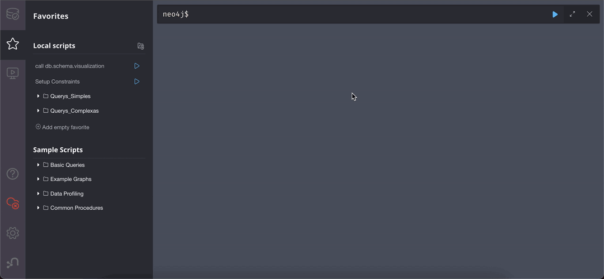
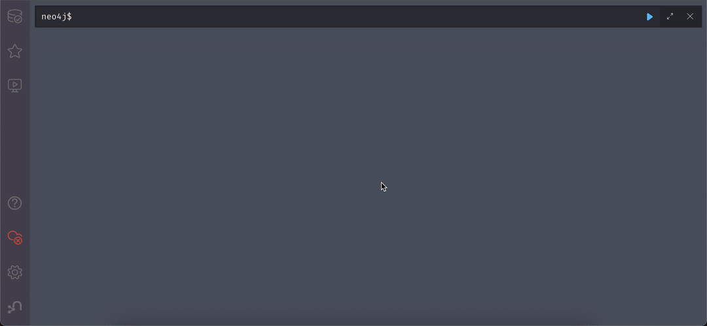

# graphdb-data-visualization

# Abstract 
Este  trabalho  apresenta  uma  an ́alise  dos  dados  de  interac ̧ ̃ao  deusu ́arios  do  portal  de  not ́ıcias  G1.   Atrav ́es  de  um  conjunto  de  publicac ̧ ̃oesrealizadas  no  portal  e  das  informac ̧ ̃oes  de  interac ̧ ̃ao  dos  usu ́arios  com  es-sas publicac ̧ ̃oes, o trabalho busca entender o comportamento de usu ́arios emrelac ̧ ̃ao`as not ́ıcias consumidas.  A base de dados possui informac ̧ ̃oes de maisde 300 mil usu ́arios e 46 mil artigos de not ́ıcias, totalizando 3 milh ̃oes de cli-ques nas p ́aginas do portal do G1. O trabalho pretende apresentar quais s ̃ao ascaracter ́ısticas principais da interac ̧ ̃ao dos usu ́arios com o portal.

# Project 

The system consists in a graph-oriented database, Neo4j, used alongside with Neo4j Browser, our web application based on queries and data visualization.

As we opted for a grah database, it's really interesting the fact of being able to interact with the results: it's possible to move the nodes, expand a set of nodes and relationships and be able to understand and infer properties just by visually seeing the results.

# Setup

The entire project has been _dockerized_: both database and web application are services in our `docker-compose.yml` file.
Due to it, just executing `make services-up` allows a local deploys of our system and opens it in the browser. (The default database is neo4j and the password is test).

The have a local script to seed the database with a sample of the entire dataset. However, it requires to insall `node` dependencies in the root folder and also in the api folder. To simplify this, it's possible to run `make install` (although it expects to have yarn installed).

Its valid to mention that in case of being the first time running the project and for configuring de database constraints and internal rules, it's necessary to run the `Setup Constraints` script in Neo4j Browser (explained in the next section how to import and run scripts). 
Example below:

# Executing
Once having the services running by `docker-compose` we just need to open http://localhost:7474/browser/ in a browser.
The default database is `neo4j` and the password is `test`. Even though is possible to point to a remote database, we are using it local to simplify the execution.

For importing the scripts, we need to drag the `queries_scripts.zip` and drop it in the Favorites tab in the web app.
Then we are able to press the play icon in any of the imported scripts (give prefference to executo those with `visual` in the name as they're have an enhanced visualzation in our tool)
Example below:

